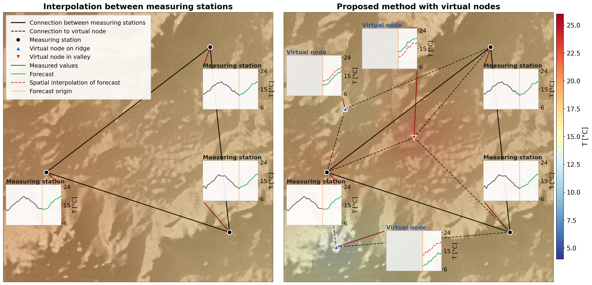

# Contextualized spatio-temporal graph-based method for forecasting sparse geospatial sensor networks

Official implementation accompanying:

> Niko Uremović, Domen Mongus, Aleksander Pur, Niko Lukač. **Contextualized
> spatio-temporal graph-based method for forecasting sparse geospatial sensor
> networks.** *Expert Systems with Applications*, vol. 294, p. 128779, 2025.

Sparse sensor networks (weather stations, traffic counters, air-quality
monitors, ...) leave large unmeasured gaps between stations. The usual fix
forecasts at the real stations and spatially interpolates those forecasts
outward — treating the forecasting model itself as blind to anything beyond
the observed graph. This work instead embeds **virtual nodes** — unobserved
locations — directly into the graph and trains the GCRNN to forecast them
end-to-end alongside the real stations, conditioned on the same raster/
contextual side-information (terrain, land cover, ...) as the real ones,
rather than smoothing predictions after the fact:



Three domains are covered, each with the same modeling pipeline:

| domain  | data                                   | scripts (suffix) |
|---------|-----------------------------------------|-------------------|
| meteo   | weather station network (Slovenia)      | `_meteo` |
| traffic | motorway traffic counters               | `_traffic` |
| air     | air-quality monitoring stations         | `_air` |

## Repository layout

```
data_handling/       loading & preprocessing: graphs, timeseries, grids, interpolation baselines,
                     graph virtualization (masking/reconnecting virtual nodes),
                     and generate_expw_graphs.py (one-off script to precompute
                     reconnected, exponentially-weighted graphs)
models_impl/         model definitions (GCRNNBase, GCRNNVirtual, ConvLSTM context baseline)
training/            training loop(s)
eval_vis/            inference helpers
interpolation/       classical spatial-interpolation grid-search baselines (IDW / kriging / TPS)

hyperparams*.py   hyperparameter sweep for the base (no virtual nodes) GCRNN
reference_methods*.py      classical interpolation baselines (IDW/kriging/TPS/raster-ConvLSTM) vs. the base model
virtual*.py                the virtual-node GCRNN (main model of this work)
```

## Installation

Requires Python >= 3.10.

```bash
pip install -e .
```

This installs the pinned dependencies from `pyproject.toml` (PyTorch, PyTorch
Geometric, PyTorch Geometric Temporal, NumPy, pandas, NetworkX, natsort,
pyproj, matplotlib) and puts the repository on your Python path in editable
mode, so every script — including the ones inside `interpolation/` and
`data_handling/` — can be run directly regardless of your current working
directory, e.g.:

```bash
python virtual_meteo.py
python interpolation/interpolation_air.py
python data_handling/generate_expw_graphs.py
```

Alternatively, if you don't want an editable install:

```bash
pip install -r requirements.txt
```

but then always run scripts from the repository root (so the top-level
modules and the `data_handling`/`models_impl`/`training`/`eval_vis` packages
resolve on `sys.path`).

**GPU**: device selection goes through `training.training.get_device()`,
which picks CUDA device 0 when a GPU is available (matching this project's
original behavior) and otherwise falls back to CPU. Every script that runs
a model calls this instead of hardcoding a device, so nothing breaks on a
CPU-only machine — it just runs on CPU (slowly, for anything but a quick
smoke test). There's no multi-GPU or device-selection flag; it's always
"GPU 0 if present, else CPU".

## Data

None of the underlying datasets are included in this repository. The full
`data/` tree (meteo, traffic, and air, in the layout described below) is
archived on Zenodo:

[**10.5281/zenodo.17091212**](https://doi.org/10.5281/zenodo.17091212)

It's a split 7-Zip archive — download every part, open the first (`.7z.001`)
in [7-Zip](https://www.7-zip.org/) (it pulls in the rest automatically),
and place the extracted contents at `data/` in the repository root. See
[DATA.md](DATA.md) for the exact folder layout and naming.

## Pretrained models

Pretrained virtual-node GCRNN checkpoints (the proposed method) are
published on HuggingFace:

[**sampa-project/contextual-gcn-sparse**](https://huggingface.co/sampa-project/contextual-gcn-sparse)

Download it and place its contents at `models/` in the repository root —
its `air/`, `meteo/`, `traffic/` folders become `models/air/`,
`models/meteo/`, `models/traffic/` — then run `inference_meteo.py` /
`inference_traffic.py` / `inference_air.py` to evaluate a checkpoint on its
k-fold test split without retraining. See [MODELS.md](MODELS.md) for the
exact layout, the published configurations, and full usage.

## Running

Every script takes CLI arguments (`--help` lists them) and writes results
under `results/experiments/...`. Two conventions apply, depending on the
script family:

- **`hyperparams*.py`** (hyperparameter sweeps): with no arguments,
  every combination of `--filters`/`--khops`/`--layers` in the default grid
  is run in nested loops. Passing any of these flags pins *that* dimension
  to the given single value while the others keep sweeping their default
  list.

  ```bash
  python hyperparams_meteo.py                        # full grid sweep
  python hyperparams_meteo.py --filters 256           # khops/layers still swept
  python hyperparams_meteo.py --filters 256 --khops 2 --layers 3  # single run
  ```

- **`reference_methods*.py`** and **`virtual*.py`** (the actual experiments,
  run across k-fold splits): the fold count is fixed per dataset (not a CLI
  option) — 9 for meteo, 10 for traffic, 8 for air. With no arguments, every
  fold is run at the model size the source project originally used
  (`--filters`/`--khops`/`--layers`, plus `--virtual-ratio` for `virtual*.py`).
  Passing `--fold` restricts the run to that one fold; passing any other
  flag overrides just that value for all folds run. Both script families
  always condition on the dataset's contextual features — there's no
  no-context ablation mode. `interp_raster`'s ConvLSTM baseline has no
  `khops` concept, but uses the same `--filters`/`--layers` as the rest of
  the script's run.

  ```bash
  python virtual_air.py                          # original config, every fold
  python virtual_air.py --fold 2 --filters 32      # fold 2 only, filters=32
  python reference_methods_meteo.py --fold 0       # just fold 0
  python reference_methods_meteo.py --filters 128 --layers 3  # every fold, bigger model
  ```

Each script's module docstring documents its exact defaults; function
docstrings on `base_model`/`virtual`/`base_interp`/`interp_base`/
`interp_raster` document their parameters.

## Citation

If you use this code, please cite:

```bibtex
@article{uremovic2025contextualized,
  title={Contextualized spatio-temporal graph-based method for forecasting sparse geospatial sensor networks},
  author={Uremovi{\'c}, Niko and Mongus, Domen and Pur, Aleksander and Luka{\v{c}}, Niko},
  journal={Expert Systems with Applications},
  volume={294},
  pages={128779},
  year={2025},
  publisher={Elsevier}
}
```
